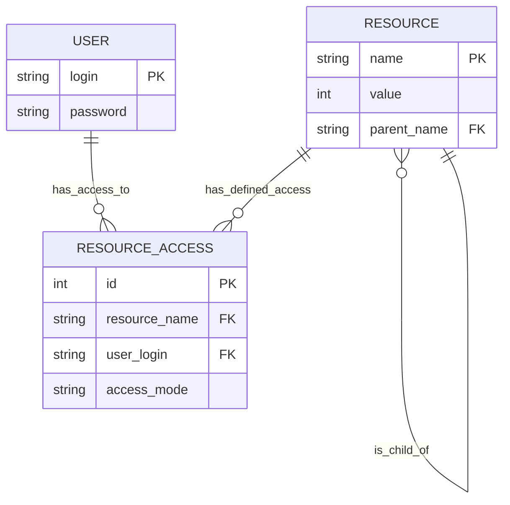

# Описание сущностей, атрибутов и связей:
## 1. User
		login (string, pk)
		password (string)
## 2. Resource:
		name (string, pk)
		id(string):	
		value (int)
		parent_name (string, fk)
## 3. ResourceAccess:
		id (int, pk)
		resource_id (string, fk)
		user_login (string, fk)
		access_mode (string)
## Связи:
User <-> ResourceAccess

Resource <-> ResourceAccess

Resource <-> Resource

# ER-диаграмма:

# Техническая часть
СУБД: SQLite

Драйвер: JDBC

Подход: Чистый JDBC без ORM-фреймворков

Файл БД: top-secret.db (создается в рабочей директории)

## Механизм заполнения ДБ
Инициализация БД выполняется через Kotlin-скрипт:

Создание таблиц - выполняются DDL-запросы для создания таблиц user, resource, resource_access

Заполнение пользователей - данные берутся из UserStorage

Рекурсивное заполнение ресурсов - иерархическая структура из MainResource преобразуется в плоскую реляционную модель

Заполнение прав доступа - для каждого ресурса создаются записи в resource_access на основе accessList

# Изменения в коде
## Реализованные компоненты:
1. Data Access Layer (repository/sqlite/Database.kt):
	Работа с БД через JDBC

	Функции для получения ресурсов по имени и пути

	Операции обновления значений ресурсов

	Проверка существования пользователей и ресурсов

	Изоляция SQL-логики от бизнес-правил

2. Business Logic Layer (services/ResourceManager.kt)
	Валидация запроса (объём запроса, права доступа)

	Обработка действий с проверкой прав

	Интеграция с сервисом контроля доступа

3. Access Control Layer (services/AccessControlService.kt)
	Проверка прав доступа

	Поддержка различных уровней доступа

## А зачем:
Разделение ответственности - чёткое разделение на слои доступа к данным и бизнес-логики для улучшения тестируемости и сопровождаемости кода

Иерархическая работа с ресурсами - поддержка древовидной структуры ресурсов с эффективным доступом через пути

Постоянное хранение - переход с in-memory данных на SQLite с сохранением функциональности и добавлением надежности

Централизованное управление доступом - единая точка проверки прав для всех операций с ресурсами
