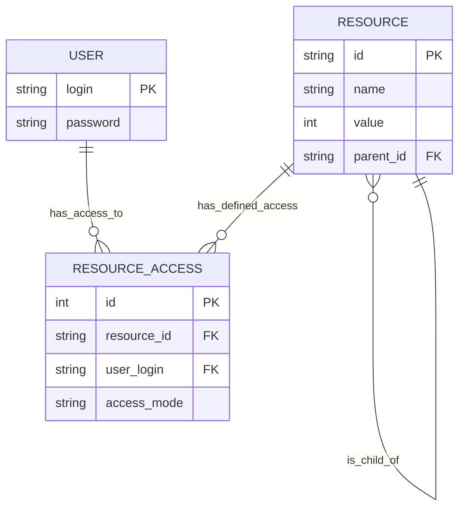

# Описание сущностей, атрибутов и связей:
## 1. User
		login (string, pk)
		password (string)
## 2. Resource:
		id(string):	
		name (string)
		value (int)
		parent_id (string, fk)
## 3. ResourceAccess:
		id (int)
		resource_id (string, fk)
		user_login (string, fk)
		access_mode (string)
## Связи:
User <-> ResourceAccess

Resource <-> ResourceAccess

Resource <-> Resource

# ER-диаграмма:

# Техническая часть
БД: H2.

Драйвер: JDBC.

Управление: Ручное управление соединениями.

Инициализация и заполение БД будет выполнятся за счет sql скриптов.
# Изменения в коде
WIP
